# 대호 I&T 사내 협업 플랫폼 — 백엔드

회의 녹음부터 STT 변환·요약·이슈 추적까지 전 생애주기를 자동화하는 사내 협업 도구의 백엔드 서버입니다.
<br>
<br>
## 프로젝트 데모


<br>
---

## 기술 스택


---

## 시스템 아키텍처

---

## 주요 기능 및 기술적 의사결정

### 1. Redis 기반 비동기 STT 파이프라인

녹음 파일을 `RECORDING → ENCODING → PROCESSING → SUMMARIZING → COMPLETED` 5단계로 처리한다. 각 단계가 수십 초~수 분 소요되므로 클라이언트 요청과 처리 파이프라인을 분리해야 했다.

**Kafka 대신 Redis를 선택한 이유**

Kafka 도입도 검토했으나, 4인 팀 규모에서 브로커 운영 부담과 태스크 상태 조회를 위한 별도 저장소가 추가로 필요한 점이 걸렸다. Redis는 이미 캐싱 목적으로 도입되어 있었고, ZSet의 score 기반 우선순위 제어와 Key Expiration Event를 조합하면 **태스크 큐 + 상태 캐싱 + 장애 감지를 단일 인프라**로 해결할 수 있어 선택했다.

- **Redis ZSet 큐**: `@Scheduled` 2초 주기 배치 스케줄러가 ZSet을 소비하며 Daglo STT API 폴링
- **`@Async` 비동기 분리**: 인코딩 작업을 별도 스레드에서 처리해 HTTP 응답 지연 방지
- **Redis 캐싱 + DB Fallback**: 상태 정보는 Redis에 캐싱, Redis 장애 시 DB에서 복원

**비정상 종료 감지 — Redis TTL Heartbeat**

클라이언트가 강제 종료되면 녹음 종료 API가 호출되지 않아 파일이 `RECORDING` 상태에 영구히 묶이는 문제가 있었다. DB 주기 스캔으로 오래된 상태를 정리하는 방법도 검토했지만, 정상적인 긴 회의와 비정상 종료를 구분할 기준이 없어 오탐 위험이 있었다.

해결책은 청크 업로드마다 TTL 30초짜리 `stt:recording:heartbeat:{sttId}` 키를 갱신하고, Key Expiration Event로 만료를 감지해 즉시 Encoding 태스크를 제출하는 구조다. Redis Keyspace Notification이 at-most-once 전달이므로, `@Scheduled` 배치가 heartbeat 키 없는 `RECORDING` 레코드를 60초 주기로 스캔하는 안전망도 함께 운영한다.

---

### 2. 크로스 브라우저 웹 푸시 알림

이슈·회의 등록 시 관련자 전원에게 실시간 푸시 알림을 전송해야 했다. Safari는 FCM을 지원하지 않아 두 경로를 모두 처리해야 했다.

- **FCM / Native APNs 분기**: 구독 등록 시 브라우저 타입을 저장해두고, 전송 시 적절한 클라이언트로 라우팅
- **Exponential Backoff + Jitter**: `delay = min(base × 2^attempt, maxDelay) + random(0, jitter)` — 동시 재시도 집중(Thundering Herd) 방지
- **Redis DLQ**: 3회 재시도 실패 시 DLQ에 적재, `@Scheduled` 배치가 주기적으로 재전송
- **N+1 최적화**: 알림 수신자 N명에 대해 `em.getReference()`로 SELECT를 제거하고 `saveAll()`로 Batch INSERT 수행. 100건 기준 쿼리 수 200회 → 1회.

---

### 3. AOP 기반 선언적 변경 이력 추적

서비스 메서드마다 로깅 코드를 직접 삽입하면 관심사 혼재와 반복 코드가 누적된다. `@TrackChanges` 커스텀 애노테이션 하나로 선언하면 해당 메서드의 엔티티 변경이 자동 기록되도록 설계했다.

**Before/After 동일 참조 문제**

JPA 1차 캐시 특성상 Before 스냅샷과 After가 같은 객체를 참조하게 되어, 메서드 실행 중 필드가 변경되면 Before도 함께 바뀌는 문제가 있었다. Before 캡처 직후 `entityManager.detach()`로 영속성 컨텍스트에서 분리해 스냅샷을 고정하고, After는 `entityManager.find()`로 재조회해 실제 변경 상태를 확보하는 방식으로 해결했다.

변경 이력은 `{"type":"UPDATE","field":"상태","before":"IN_PROGRESS","after":"COMPLETED"}` 형태의 JSON으로 직렬화해 저장한다.

---

## 데이터 모델

```mermaid
erDiagram
    member {
        bigint member_id PK
        varchar login_id
        varchar password
        varchar name
        varchar email
        varchar phone
        enum role "ADMIN, USER"
        bit is_employed
        bigint department_id FK
        bigint job_position_id FK
    }

    issue {
        bigint issue_id PK
        varchar title
        text content
        enum status "PLANNED, IN_PROGRESS, COMPLETED"
        date start_date
        date end_date
        bit is_private
        bit is_del
        bigint category_id FK
    }

    meeting {
        bigint meeting_id PK
        varchar title
        text content
        enum status "PLANNED, IN_PROGRESS, COMPLETED"
        datetime start_date
        datetime end_date
        bit is_private
        bit is_del
        bigint issue_id FK
        bigint category_id FK
    }

    stt {
        bigint stt_id PK
        enum status "RECORDING, ENCODING, ENCODED, PROCESSING, SUMMARIZING, COMPLETED"
        longtext content
        text summary
        varchar rid
        varchar summary_rid
        int chunking_cnt
        int retry_count
        bigint meeting_id FK
    }

    log {
        bigint log_id PK
        enum change_type "CREATE, UPDATE, DELETE"
        enum target_type "ISSUE, MEETING, COMMENT, STT, MEMBER"
        bigint target_id
        varchar title
        varchar update_field
        text message
        varchar member_name
    }

    notification {
        bigint notification_id PK
        varchar message
        varchar forward_url
        bit is_read
        bigint member_id FK
    }

    comment {
        bigint comment_id PK
        text content
        enum target_type "ISSUE, MEETING"
        bigint target_id
        bit is_del
        bigint member_id FK
    }

    file {
        bigint file_id PK
        varchar original_name
        varchar saved_name
        varchar path
        bigint size
        enum target_type "ISSUE, MEETING, STT, MEMBER, COMMENT"
        bigint target_id
    }

    member ||--o{ issue : "host"
    member ||--o{ notification : "receives"
    member ||--o{ comment : "writes"
    issue ||--o{ meeting : "has"
    meeting ||--o| stt : "has"
    issue ||--o{ log : "tracked_by"
    meeting ||--o{ log : "tracked_by"
```



---

## Getting Started

### 사전 요구사항

- Docker & Docker Compose
- [Daglo STT API](https://daglo.ai) 토큰
- Firebase 서비스 계정 키 (Chrome/Edge 푸시)
- VAPID 키 페어 (Web Push 표준)
- ffmpeg (오디오 인코딩 — 컨테이너 외부 실행 시)

### 환경변수 설정

`application.sample.properties`를 복사해 `application.properties`를 만들고 아래 항목을 채운다.

```properties
# DB
spring.datasource.url=jdbc:mysql://localhost:3306/daeho_db?useSSL=false&serverTimezone=Asia/Seoul&createDatabaseIfNotExist=true
spring.datasource.username=root
spring.datasource.password=your_password
spring.jpa.hibernate.ddl-auto=update

# Redis
spring.data.redis.host=localhost
spring.data.redis.port=6379
spring.data.redis.repositories.enabled=false

# JWT
jwt.key=your_jwt_secret_key_min_32_chars

# Daglo STT
daglo.api.token=your_daglo_api_token
daglo.api.base-url=https://apis.daglo.ai
daglo.api.timeout=30000

# Web Push (VAPID)
vapid.public.key=your_vapid_public_key
vapid.private.key=your_vapid_private_key
vapid.service.mail=mailto:your@email.com

# STT Heartbeat TTL (초)
stt.recording.heartbeat-ttl-seconds=30

# 파일 저장 경로
file.location=/your/upload/path
ffmpeg.path=/usr/bin/ffmpeg
```

### Docker Compose로 실행

인프라(MySQL + Redis)만 컨테이너로 띄우고 애플리케이션을 로컬에서 실행하는 방법이다.

```bash
# 네트워크 생성 (최초 1회)
docker network create app-network

# MySQL + Redis 실행
docker compose up -d mysql redis

# 애플리케이션 빌드 및 실행
./gradlew bootRun
```

백엔드까지 포함해 전체를 컨테이너로 띄우려면:

```bash
docker compose up -d
```

> **포트**: Spring Boot `8080`, MySQL `3306`, Redis `6379`

### 개발 서버 확인

```bash
# 헬스 체크
curl http://localhost:8080/actuator/health

# 로그인
curl -X POST http://localhost:8080/login \
  -H "Content-Type: application/json" \
  -d '{"loginId":"admin","password":"your_password"}'
```

---

## 프로젝트 구조

```
src/main/java/com/codehows/daehobe/
├── config/
│   ├── SpringSecurity/   # SecurityConfig, AuthEntryPoint, AccessHandler
│   └── jwtAuth/          # JwtFilter, JwtService
├── issue/                # 이슈 CRUD
├── meeting/              # 회의 CRUD
├── stt/
│   ├── controller/
│   ├── service/
│   │   └── processing/   # SttPollingScheduler, SttEncodingTaskExecutor
│   └── redis/            # HeartbeatExpirationListener
├── notification/         # FCM / APNs 분기 푸시
├── logging/
│   └── AOP/              # @TrackChanges, LoggingAspect
├── comment/
├── member/
└── file/
```
