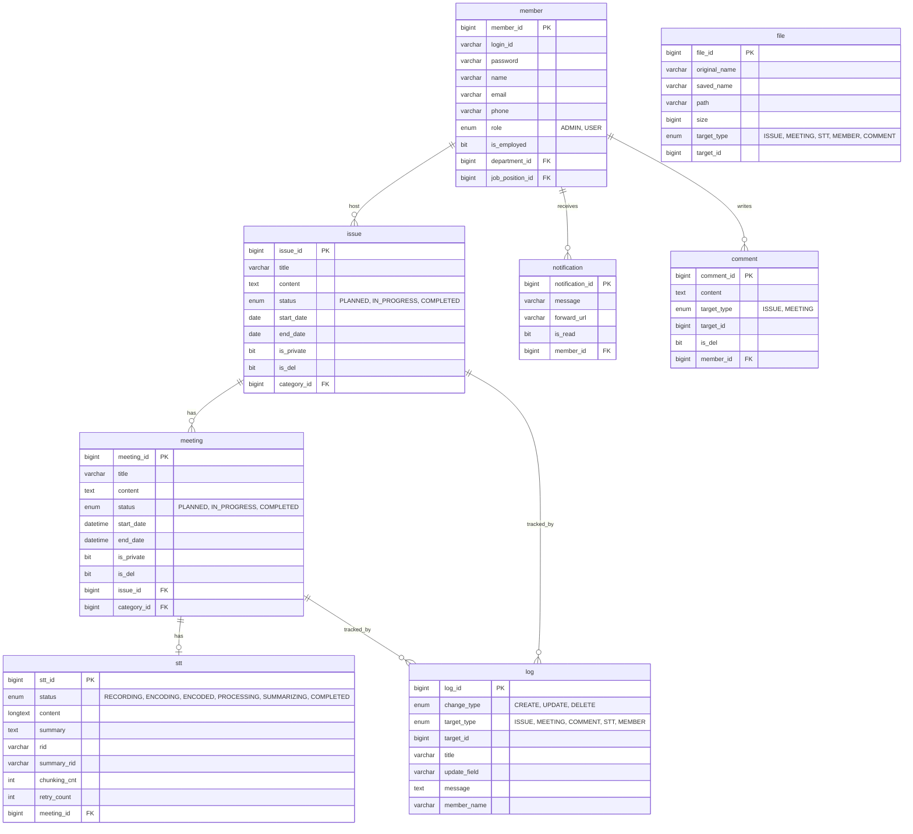

# 대호 I&T 사내 협업 플랫폼 — 백엔드

회의 녹음부터 STT 변환·요약·이슈 추적까지 전 생애주기를 자동화하는 사내 협업 도구의 백엔드 서버입니다.
<br>
<br>
## 프로젝트 데모


<br>
---

## 기술 스택


---

## 시스템 아키텍처

---

## 주요 기능


---

## 데이터 모델



---

## Getting Started

### 사전 요구사항

- Docker & Docker Compose
- [Daglo STT API](https://daglo.ai) 토큰
- Firebase 서비스 계정 키 (Chrome/Edge 푸시)
- VAPID 키 페어 (Web Push 표준)
- ffmpeg (오디오 인코딩 — 컨테이너 외부 실행 시)

### 환경변수 설정

`application.sample.properties`를 복사해 `application.properties`를 만들고 아래 항목을 채운다.

```properties
# DB
spring.datasource.url=jdbc:mysql://localhost:3306/daeho_db?useSSL=false&serverTimezone=Asia/Seoul&createDatabaseIfNotExist=true
spring.datasource.username=root
spring.datasource.password=your_password
spring.jpa.hibernate.ddl-auto=update

# Redis
spring.data.redis.host=localhost
spring.data.redis.port=6379
spring.data.redis.repositories.enabled=false

# JWT
jwt.key=your_jwt_secret_key_min_32_chars

# Daglo STT
daglo.api.token=your_daglo_api_token
daglo.api.base-url=https://apis.daglo.ai
daglo.api.timeout=30000

# Web Push (VAPID)
vapid.public.key=your_vapid_public_key
vapid.private.key=your_vapid_private_key
vapid.service.mail=mailto:your@email.com

# STT Heartbeat TTL (초)
stt.recording.heartbeat-ttl-seconds=30

# 파일 저장 경로
file.location=/your/upload/path
ffmpeg.path=/usr/bin/ffmpeg
```

### Docker Compose로 실행

인프라(MySQL + Redis)만 컨테이너로 띄우고 애플리케이션을 로컬에서 실행하는 방법이다.

```bash
# 네트워크 생성 (최초 1회)
docker network create app-network

# MySQL + Redis 실행
docker compose up -d mysql redis

# 애플리케이션 빌드 및 실행
./gradlew bootRun
```

백엔드까지 포함해 전체를 컨테이너로 띄우려면:

```bash
docker compose up -d
```

> **포트**: Spring Boot `8080`, MySQL `3306`, Redis `6379`

## 프로젝트 구조

```
src/main/java/com/codehows/daehobe/
├── config/
│   ├── SpringSecurity/   # SecurityConfig, AuthEntryPoint, AccessHandler
│   └── jwtAuth/          # JwtFilter, JwtService
├── issue/                # 이슈 CRUD
├── meeting/              # 회의 CRUD
├── stt/
│   ├── controller/
│   ├── service/
│   │   └── processing/   # SttPollingScheduler, SttEncodingTaskExecutor
│   └── redis/            # HeartbeatExpirationListener
├── notification/         # FCM / APNs 분기 푸시
├── logging/
│   └── AOP/              # @TrackChanges, LoggingAspect
├── comment/
├── member/
└── file/
```
